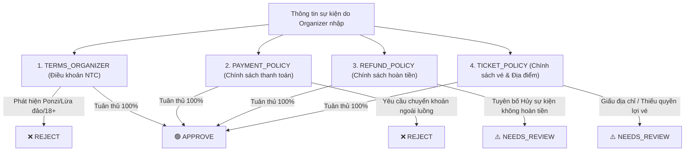

# 🛡️ Tính Năng AI Event Review & Moderation (Đối Chiếu Chính Sách EventHub)

Tài liệu này mô tả chi tiết cách hệ thống AI tự động kiểm duyệt sự kiện dựa trên **4 bộ chính sách chính thức** của nền tảng **EventHub**:
1. **`TERMS_ORGANIZER`**: Điều khoản sử dụng dành cho Nhà tổ chức.
2. **`REFUND_POLICY`**: Chính sách hoàn tiền vé & sự kiện.
3. **`PAYMENT_POLICY`**: Chính sách thanh toán và giao dịch.
4. **`TICKET_POLICY` & `PRIVACY_POLICY`**: Chính sách vé, check-in và bảo mật thông tin.

---

## 1. 📋 Bản Đồ Đối Chiếu Chính Sách & Điều Kiện Kiểm Duyệt



### Chi tiết các quy tắc đối chiếu:

| Mã Chính Sách | Điều Khoản Đối Chiếu | Hành Vi Vi Phạm Cần Bắt Lỗi | Mức Độ Rủi Ro & Kết Luận |
| :--- | :--- | :--- | :--- |
| **`PAYMENT_POLICY`** | **Điều 2 & 6: Kênh thanh toán & Trách nhiệm** | - Kêu gọi người mua chuyển khoản STK cá nhân ngoài web.<br>- Hướng dẫn giao dịch qua Zalo/Telegram để né phí sàn. | 🔴 **`REJECT`** *(High Risk)* |
| **`TERMS_ORGANIZER`** | **Điều 4: Trách nhiệm Nhà tổ chức** | - Cam kết lợi nhuận tài chính phi thực tế (*"x100 vốn", "lãi 30%/tháng", "bao lỗ 100%"*).<br>- Cổ súy cờ bạc, chia sẻ tool hack tài xỉu, nội dung 18+.<br>- Tạo đơn ảo, thao túng vé hoặc vi phạm bản quyền. | 🔴 **`REJECT`** *(High Risk)* |
| **`REFUND_POLICY`** | **Điều 3 & 5: Trường hợp & Trách nhiệm hoàn tiền** | - NTC tự ý đưa ra quy định: *"Hủy sự kiện vẫn không hoàn tiền dưới mọi lý do"* (Trái ngược hoàn toàn với quyền lợi người mua khi sự kiện hoãn/hủy).<br>- Mâu thuẫn giữa *"Cam kết hoàn tiền"* và *"Miễn đổi trả"*. | 🟡 **`NEEDS_REVIEW`** *(Medium Risk)* |
| **`TICKET_POLICY`** | **Điều 2 & 5: Loại vé & Điều kiện sử dụng** | - Giấu địa chỉ (*"Địa chỉ bí mật sẽ nhắn sau"*), thiếu địa chỉ số nhà/hội trường cụ thể.<br>- Thiếu khung giờ bắt đầu/kết thúc hoặc thời gian nằm ở quá khứ.<br>- Không nêu rõ quyền lợi các hạng vé (Thường, VIP). | 🟡 **`NEEDS_REVIEW`** *(Medium Risk)* |

---

## 2. 📦 Định Dạng Output JSON Chuẩn Đối Chiếu Chính Sách

Khi AI phân tích, kết quả trả về sẽ gắn liền với mã chính sách bị vi phạm:

```json
{
  "decision": "REJECT", // "APPROVE" | "NEEDS_REVIEW" | "REJECT"
  "risk_score": 95,      // Thang điểm rủi ro: 0 -> 100
  "quality_score": 35,   // Thang điểm chất lượng nội dung: 0 -> 100
  "summary": "Sự kiện vi phạm nghiêm trọng Chính sách thanh toán do yêu cầu khách hàng chuyển khoản cá nhân ngoài hệ thống.",
  "policy_violations": [
    {
      "policy_code": "PAYMENT_POLICY",
      "severity": "HIGH",
      "issue": "Yêu cầu chuyển khoản vào STK cá nhân ngoài hệ thống EventHub (Vi phạm Điều 2 & Điều 6 PAYMENT_POLICY).",
      "highlighted_text": "vui lòng không thanh toán trên web mà hãy chuyển khoản trực tiếp vào STK cá nhân: 1903xxx"
    },
    {
      "policy_code": "TERMS_ORGANIZER",
      "severity": "HIGH",
      "issue": "Hành vi trốn phí nền tảng và gây rủi ro lừa đảo giao dịch (Vi phạm Điều 4 TERMS_ORGANIZER).",
      "highlighted_text": "Để tránh phí nền tảng"
    }
  ],
  "suggestions": [
    "Mọi giao dịch bán vé bắt buộc phải thông qua cổng thanh toán chính thức của EventHub để bảo vệ quyền lợi người mua."
  ]
}
```

---

## 3. 🧪 Chạy Kiểm Thử Nhanh

Mở Terminal và chạy:
```bash
python scripts/test_review.py
```
Menu test gồm 5 kịch bản thực tế đại diện cho từng chính sách:
- **Phím 1:** Test vi phạm `PAYMENT_POLICY` (Chuyển khoản cá nhân né phí).
- **Phím 2:** Test vi phạm `REFUND_POLICY` (Hủy show không hoàn tiền).
- **Phím 3:** Test vi phạm `TICKET_POLICY` (Giấu địa chỉ bí mật).
- **Phím 4:** Test vi phạm `TERMS_ORGANIZER` (Lừa đảo Ponzi x100).
- **Phím 5:** Test sự kiện Hợp Lệ 100% (Đạt chuẩn tất cả chính sách).
